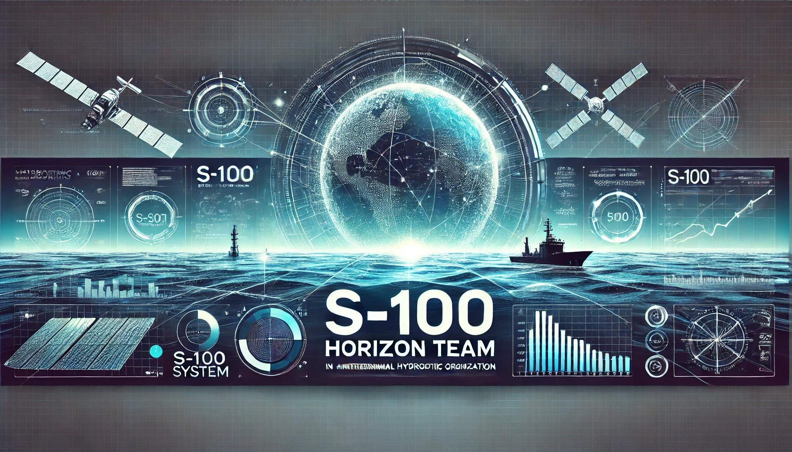

# Vortex
*S-100: An Unexpected Journey*



## Project Overview:

The project aimed to implement the S-100 standard within ArcGIS Pro to improve the creation, management, and dissemination of electronic navigational charts (ENCs) in compliance with the International Hydrographic Organization's (IHO) S-100 framework. The implementation of S-100 standards in ArcGIS Pro facilitates the transition from traditional paper charts to modern digital navigational tools, enhancing safety and efficiency in maritime navigation.

## Key Objectives:

1. **Compliance with S-100 Standards and Specifications**\
**Expectation:** *The production system must fully apply to the S-100 framework, ensuring that all datasets conform to the required feature catalogs, metadata structures, and exchange formats.*\
**Reasoning:** *Compliance guarantees interoperability with other S-100-based systems, supports standardization in hydrographic data production, and ensures regulatory alignment.*

2. **Scalability and Flexibility for Multi-Domain Support**\
  **Expectation:** *The system should be capable of producing and managing datasets across multiple S-100 standards, such as S-101 (ENCs), S-122 (Marine Protected Areas), S-125 (Marine Aids to Navigation), and S-132 (Marine Harbour Infrastructure) etc.*\
  **Reasoning:** *As hydrographic offices and maritime stakeholders adopt S-100, the system must handle diverse data types efficiently while allowing for future expansions and standard updates.*

3. **Automation and Efficient Workflow Management**\
  **Expectation:** *The system should support automation in data validation, transformation, and distribution to minimize manual effort and improve efficiency.*\
  **Reasoning:** *Automated workflows help reduce errors, accelerate production timelines, and ensure that updates and corrections are implemented consistently across datasets.*

4. **Seamless Data Exchange and Interoperability**\
  **Expectation:** *The system must facilitate seamless data exchange between hydrographic offices, maritime authorities, and end-users, supporting secure and standardized delivery methods.*\
  **Reasoning:** *Effective interoperability ensures that produced datasets can be integrated into Electronic Chart Display and Information Systems (ECDIS), Geographic Information Systems (GIS), and other maritime applications without compatibility issues.*


## Project Structure

The [project structure](https://binarybytez.com/understanding-clean-architecture/) is designed to promote separation of concerns and modularity, making it easier to understand, test, and maintain the application.

```
├── src
│   ├── Application             # Contains all kind of applications and plugins
│   ├── Core                    # Contains the core business logic, domain models, view models, etc.
│   ├── Infrastructure          # Contains infrastructure concerns such as data access, external services, etc.
│   └── UI                      # Contains the user interface layer, including controllers, views, extensions, etc.
├── tests
│   ├── Core.Tests              # Contains unit tests for the core layer
│   ├── Infrastructure.Tests    # Contains unit tests for the infrastructure layer
│   └── UI.Tests                # Contains unit tests for the UI layer
└── README.md                   # Project documentation (you are here!)
```

## Contacts
Jens Søe Christiansen jesoe@gst.dk
